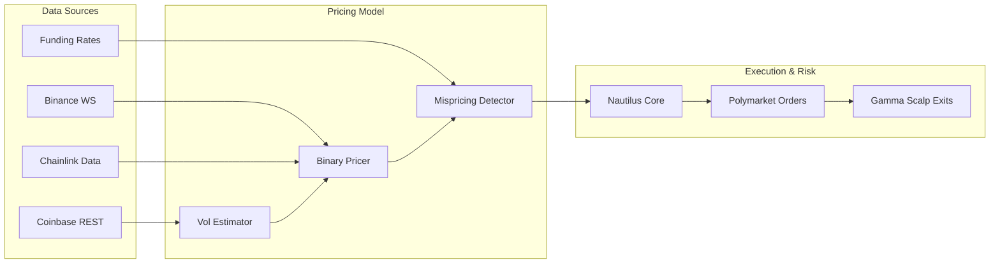

# 🤖 Polymarket BTC 15-Minute Trading Bot

[](https://www.python.org/downloads/)
[](https://nautilustrader.io/)
[](https://opensource.org/licenses/MIT)
[](https://polymarket.com)
[](https://redis.io/)
[](https://grafana.com/)

A production-grade algorithmic trading bot for **Polymarket's 15-minute BTC price prediction markets**. Built with an
advanced **V3 Quantitative Pricing Architecture** combining a Binary Options Pricing Model, Real-Time Data Streams (RTDS), and Gamma Scalping for high-frequency execution.

---

## 📋 **Table of Contents**

- [Features](#features)
- [Architecture](#architecture)
- [Prerequisites](#prerequisites)
- [Quick Start](#quick-start)
- [Configuration](#configuration)
- [Running the Bot](#running-the-bot)
- [Monitoring](#monitoring)
- [Trading Modes](#trading-modes)
- [Project Structure](#project-structure)
- [Testing](#testing)
- [Contributing](#contributing)
- [FAQ](#faq)
- [License](#license)
- [Disclaimer](#disclaimer)

---

## ✨ **Features**

| Feature | Description |
|---|---|
| **Binary Option Pricing** | Uses Merton Jump-Diffusion to compute fair value for YES/NO tokens. |
| **Real-Time Data Streams** | Sub-second Binance/Chainlink settlement oracle for precise edge calculation. |
| **Gamma Scalping** | Take-profit and late-window dynamic exit strategy to secure profits early. |
| **Volatility Estimator** | Real-time realized vol (EWMA) tracking from order book ticks. |
| **Funding Rate Filter** | Fades crowded retail positioning by tracking perpetual swap funding regimes. |
| **Multi-Signal Intelligence**| Spike Detection, Sentiment Analysis, and Price Divergence as confirmation. |
| **Risk-First Design** | Strict take-profit, cut-loss, and EV+ limits managed via Nautilus. |
| **Dual-Mode Operation** | Toggle between live trading and simulation via Redis on the fly. |

---

## 🏗️ **Architecture**

### **V3 Strategy Overview**



## Prerequisites

- Python 3.14+
- Redis - for mode switching
- Polymarket Account with API credentials
- Git

## 🚀 Quick Start

## 1. Clone the Repository

```bash
git clone https://github.com/yourusername/polymarket-btc-15m-bot.git
cd polymarket-btc-15m-bot
```

## 2. Set Up Virtual Environment

```bash
# Windows
python -m venv venv
venv\Scripts\activate

# macOS / Linux
python -m venv venv
source venv/bin/activate
```

## 3. Install Dependencies

```bash
pip install -r requirements.txt
```

## 4. Configure Environment Variables

```bash
cp .env.example .env
```
Edit `.env` with your credentials:

```env
# Polymarket API Credentials
POLYMARKET_PK=your_private_key_here
POLYMARKET_API_KEY=your_api_key_here
POLYMARKET_API_SECRET=your_api_secret_here
POLYMARKET_PASSPHRASE=your_passphrase_here

# Redis Configuration
REDIS_HOST=localhost
REDIS_PORT=6379
REDIS_DB=2

# V3 Trading Parameters
MARKET_BUY_USD=1.00
MIN_EDGE_CENTS=0.02
TAKE_PROFIT_PCT=0.30
CUT_LOSS_PCT=-0.50
VOL_METHOD=ewma
DEFAULT_VOL=0.65
USE_RTDS=true
USE_FUNDING_FILTER=true
GAMMA_EXIT_PROFIT_PCT=0.04
GAMMA_EXIT_TIME_MINS=3.0
```

## 5. Start Redis

```bash
# Windows (download from redis.io)
redis-server

# macOS
brew install redis
redis-server

# Linux
sudo apt install redis-server
redis-server
```

## 6. Run the Bot

```bash
# Test mode (trades every minute - for quick testing)
python run_bot.py --test-mode

# Live trading mode (REAL MONEY!)
python 15m_bot_runner.py --live
```

## ⚙️ Configuration Options

| Argument | Description | Default |
|---|---|---|
| `--test-mode` | Trade every minute for testing | `False` |
| `--live` | Enable live trading (real money) | `False` |
| `--no-grafana` | Disable Grafana metrics | `False` |

## View Paper Trades

```bash
python view_paper_trades.py
```

## Trading Modes

Switch Modes Without Restarting (Redis)

# Switch to simulation mode (safe)
```bash
python redis_control.py sim
```

# Switch to live trading mode (REAL MONEY!)
```bash
python redis_control.py live
```

## 📁 Project Structure

```text
polymarket-btc-15m-bot/
├── core/                        # Core business logic
│   ├── ingestion/               # Data ingestion & validation
│   ├── nautilus_core/           # NautilusTrader integration
│   └── strategy_brain/          # Signal generation & legacy processors
│
├── data_sources/                # External market & sentiment data
│   ├── binance/                 # Binance WebSocket client
│   ├── coinbase/                # Coinbase REST API client
│   └── news_social/             # Fear & Greed Index + social sentiment
│
├── execution/                   # Order placement & risk control
│   ├── execution_engine.py      # Main order execution coordinator
│   ├── polymarket_client.py     # Polymarket API wrapper & order logic
│   └── risk_engine.py           # Position sizing, SL/TP, exposure limits
│
├── monitoring/                  # Performance tracking & metrics
│   ├── grafana_exporter.py      # Prometheus metrics exporter
│   └── performance_tracker.py   # Trade logging & statistics
│
├── scripts/                     # Development & testing utilities
├── binary_pricer.py             # V3 Merton Jump-Diffusion Bin Pricing
├── bot.py                       # V3.1 Integrated BTC Strategy Entry Point
├── funding_rate_filter.py       # V3.1 Perpetual Funding Regime logic
├── mispricing_detector.py       # V3 Edge Calculation Engine
├── rtds_connector.py            # V3.1 Chainlink Settlement Oracle
├── vol_estimator.py             # V3 EWMA Volatility Estimator
├── .env.example                 # Template for environment variables
├── redis_control.py             # Switch trading mode (sim/live/test)
├── run_bot.py                   # Main bot entry point
└── README.md                    # This file
```

## Testing

Run tests for each phase independently:

```bash
python scripts/test_data_sources.py
python scripts/test_ingestion.py
python scripts/test_nautilus.py
python scripts/test_strategy.py
python scripts/test_execution.py
```

## 🤝 Contributing

Contributions are welcome! Here's how you can help:
- Fork the repository
- Create a feature branch: `git checkout -b feature`
- Commit your changes: `git commit -m 'Added feature'`
- Push to the branch: `git push origin feature/added-feature`
- Open a Pull Request

## ❓ FAQ

**Q: How much money do I need to start?**  
**A:** The bot caps each trade at $1, so you can start with as little as $10–20.

**Q: Is this profitable?**  
**A:** Yes — in simulation testing it has shown good results. However, **past performance does not guarantee future results**. Always test thoroughly in simulation mode first.

**Q: Do I need programming experience?**  
**A:** Basic Python knowledge is helpful (e.g. understanding how to run scripts and edit config files), but the bot is designed to run with just a few simple commands — no coding required for normal use.

**Q: Can I run this 24/7?**  
**A:** Yes! The bot is built for continuous operation and includes basic auto-recovery features in case of temporary connection issues.

**Q: What's the difference between test mode and normal mode?**  
**A:**
- **Test mode** — trades simulated every minute (great for quick testing and debugging)
- **Normal mode** — trades every 15 minutes (matches the intended 15-minute strategy timeframe)

## Disclaimer

TRADING CRYPTOCURRENCIES CARRIES SIGNIFICANT RISK.
This bot is for educational purposes.
Past performance does not guarantee future results.
Always understand the risks before trading with real money.
The developers are not responsible for any financial losses.
Start with simulation mode, then small amounts, then scale up.

## Acknowledgments

NautilusTrader - Professional trading framework  
Polymarket - Prediction market platform

## Contact

GitHub Issues: For bugs and feature requests

## ⭐ Show Your Support

If you find this project useful, please star the GitHub repo! It helps others discover it.
